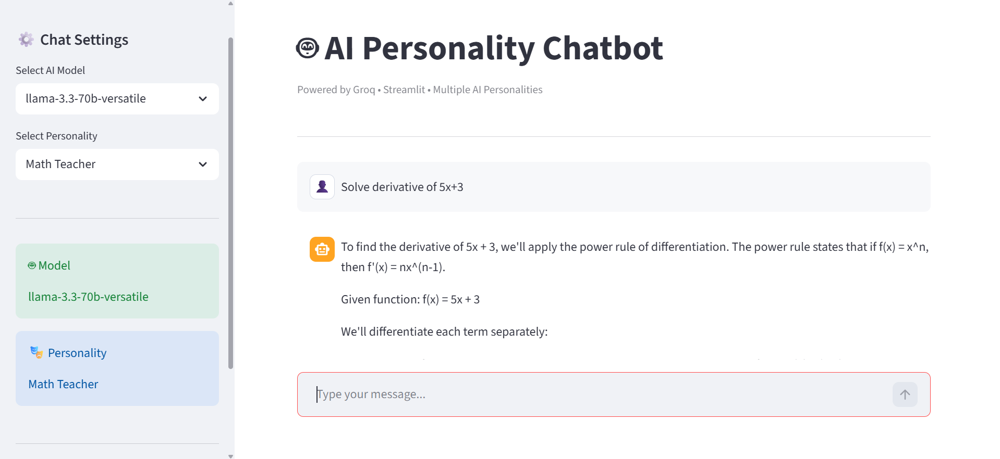

<div align="center">

# 🤖 AI Personality Chatbot

### An interactive AI chatbot powered by **Groq LLMs** and **Streamlit**

Choose an AI personality, select your preferred Groq model, and enjoy real-time conversations with personality-aware responses.

[](https://python.org)
[](https://streamlit.io)
[](https://groq.com)

---

### 🚀 Live Demo

🌐 **Application:** https://ai-personality-chatbot-spiral-lab.streamlit.app/

---



</div>

---

# ✨ Features

- 🤖 Multiple AI personalities
- ⚡ Powered by Groq's ultra-fast LLMs
- 💬 Modern Streamlit chat interface
- 🧠 Session-based conversation memory
- 🎭 Personality-based response restrictions
- 🔄 Switch AI models anytime
- 🗑️ Clear chat with one click
- 🛡️ Friendly error handling
- ☁️ Deployed on Streamlit Community Cloud

---

# 🎭 Available Personalities

| Personality | Allowed Topics |
|-------------|----------------|
| ➗ Math Teacher | Mathematics, equations, algebra, calculus, geometry |
| 🩺 Doctor | Health, symptoms, medicine, wellness |
| ✈️ Travel Guide | Destinations, visas, hotels, itineraries |
| 👨‍🍳 Chef | Recipes, cooking techniques, ingredients |
| 💻 Tech Support | Software, hardware, networking, troubleshooting |

Each personality politely refuses questions outside its assigned domain.

---

# 🛠️ Tech Stack

| Category | Technologies |
|----------|--------------|
| Language | Python |
| Framework | Streamlit |
| AI | Groq API |
| Deployment | Streamlit Community Cloud |
| Version Control | Git & GitHub |

---

# 📂 Project Structure

```text
AI-Agent-Chatbot/
│
├── app.py
├── groq_helper.py
├── prompts.py
├── requirements.txt
├── README.md
├── .gitignore
├── assets/
│   └── chatbot.png
└── .streamlit/
    └── secrets.toml
```

---

# 🚀 Getting Started

## 1️⃣ Clone the repository

```bash
git clone https://github.com/s-zaid-13/AI-Personality-Chatbot.git

cd AI-Personality-Chatbot
```

---

## 2️⃣ Create a virtual environment

### Windows

```bash
python -m venv venv

venv\Scripts\activate
```

### macOS / Linux

```bash
python3 -m venv venv

source venv/bin/activate
```

---

## 3️⃣ Install dependencies

```bash
pip install -r requirements.txt
```

---

## 4️⃣ Configure your Groq API Key

Create:

```text
.streamlit/secrets.toml
```

Add:

```toml
GROQ_API_KEY="your_groq_api_key"
```

---

## 5️⃣ Run the application

```bash
streamlit run app.py
```

The app will open at:

```text
http://localhost:8501
```

---

# 💡 Example Conversation

### 🎭 Personality: Math Teacher

**User**

> Solve 3x + 5 = 20

**Assistant**

> 3x + 5 = 20  
> 3x = 15  
> x = 5

---

**User**

> Recommend a hotel in Dubai.

**Assistant**

> I'm currently acting as a Math Teacher. Please ask me a mathematics-related question.

---

# 🧠 How Personality Enforcement Works

The selected personality is sent as a **system prompt** to the Groq model.

Each system prompt defines:

- Allowed topics
- Response behavior
- Refusal message
- Domain restrictions

This ensures the chatbot remains focused on its assigned role throughout the conversation.

---


# 🔮 Future Improvements

- ✅ Streaming responses
- 🎤 Voice input
- 🖼️ Image understanding
- 💾 Persistent chat history
- 🌍 Multi-language support
- 📄 Export conversations
- 🌙 Custom themes

---

# 🤝 Contributing

Contributions are welcome!

1. Fork the repository
2. Create a feature branch

```bash
git checkout -b feature-name
```

3. Commit your changes

```bash
git commit -m "Add new feature"
```

4. Push your branch

```bash
git push origin feature-name
```

5. Open a Pull Request

---


<div align="center">

### ⭐ If you found this project helpful, consider giving it a star!

Made with ❤️ using **Python**, **Streamlit**, and **Groq AI**

</div>